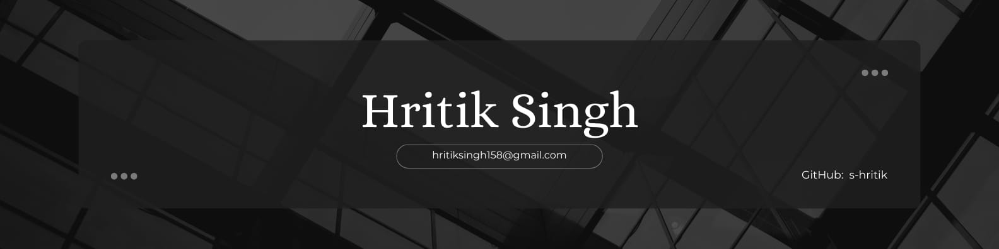

   

<h3>ABOUT ME</h3>
I'm a versatile developer, with experience in building web platforms and IoT. 
I like accessibility, performance, and robust code. In addition, I also like to help and communicate as much as I can. I usually answer questions or solve some issues on GitHub, Stack Overflow, or on tech communities because that not only helps others, but also helps me.

## 🛠️ Skills

              

